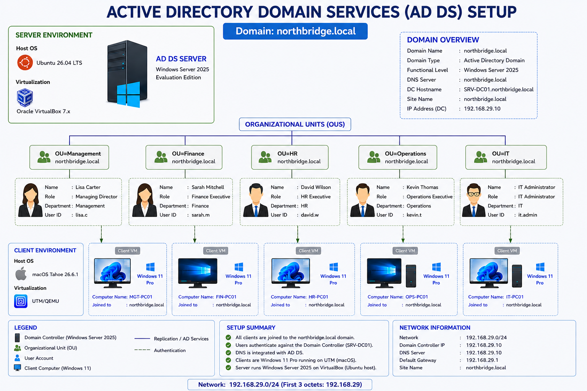

# NorthBridge Enterprise Active Directory


## 📌 Project Overview

NorthBridge is a hands-on Windows Active Directory lab built to practice and demonstrate **Windows administration, identity and access management, troubleshooting, security investigation, and technical documentation**.

The project began with a known-good Active Directory baseline and was then used to investigate three realistic workplace IT scenarios.

Each case followed a structured troubleshooting process:

```text
Problem / User Report
        ↓
Investigation
        ↓
Evidence Collection
        ↓
Root Cause
        ↓
Resolution
        ↓
Validation
        ↓
Documentation
```

The project was completed after three scenario-based cases, with all three participants rotating through the planned project roles.

This repository documents **my own lab implementation, screenshots, findings, and troubleshooting work**.

---

## 🖥️ Lab Environment

| Component             | Details                                                    |
| --------------------- | ---------------------------------------------------------- |
| 🌐 Domain             | `northbridge.local`                                        |
| 🖥️ Domain Controller | `SRV-DC01`                                                 |
| 💻 Client Systems     | `IT-PC01`, `FIN-PC01`, `HR-PC01`, `OPS-PC01`, `MGT-PC01`   |
| 🪟 Server OS          | Windows Server 2025                                        |
| 🪟 Client OS          | Windows 11 Pro                                             |
| 📦 Virtualization     | VirtualBox / UTM-QEMU depending on participant environment |

Each participant maintained an **independent Active Directory lab environment**.

The environments were not shared. Collaboration took place during the scenario-based troubleshooting and investigation activities.

---

## ⚙️ System Setup & Virtualization

The lab environments were built independently using the hardware and virtualization platforms available to each participant.

The virtualization platform was not a requirement of the project.

The important requirement was a functional:

* Windows Server environment
* Windows client environment
* Active Directory domain
* DNS configuration
* Network connectivity between systems
* Domain authentication

This allowed all three participants to reproduce the NorthBridge environment independently while carrying out their own implementation and evidence collection.

---

## 🛠️ Technologies & Skills

### Windows Administration

* Windows Server 2025
* Windows 11
* Active Directory Domain Services (AD DS)
* DNS
* Windows File Services
* Windows Client Administration

### Identity & Access Management

* User Management
* Security Groups
* Group Membership
* Organizational Units (OUs)
* Domain Authentication
* NTFS Permissions
* Share Permissions
* Access Control

### Troubleshooting & Security

* File and Folder Access Troubleshooting
* Account Lockout Investigation
* Authentication Troubleshooting
* DNS and Domain Connectivity
* Windows Client Troubleshooting
* Root-Cause Analysis
* Evidence Collection
* Security Investigation
* Incident Handling
* Technical Documentation

---

# 🏗️ Active Directory Baseline

Before beginning the scenario-based cases, each participant established a known-good Active Directory environment.

The baseline included:

* Windows Server domain controller
* `northbridge.local` Active Directory domain
* DNS configuration
* Organizational Units
* Domain users
* Security groups
* Group memberships
* Group Policy
* Password policy
* Department file shares
* NTFS permissions
* Share permissions
* Windows client domain joining
* Domain authentication

The baseline provided the known-good state used as the reference point for the three troubleshooting cases.

### 🔄 AD DS Setup Flow

The overall Active Directory setup is illustrated below.



---

# 🔎 Scenario-Based Troubleshooting

Three realistic workplace IT scenarios were completed using the known-good Active Directory baseline.

## Case 01 — Finance Folder Access

The first case focused on a Finance department file access problem.

### Focus Areas

* NTFS permissions
* Share permissions
* Security groups
* User access
* Access control
* Permission troubleshooting
* Evidence-based investigation

The investigation demonstrated how to determine whether an access problem was related to the user account, group membership, share permissions, or NTFS permissions.

📁 **Case documentation:**
[Case 01 — Finance Folder Access](cases/case-01-finance-folder-access/)

---

## Case 02 — Account Lockout

The second case focused on a user account becoming locked out.

### Focus Areas

* Active Directory user accounts
* Account lockout
* Authentication
* User account status
* Security investigation
* Evidence collection
* Account recovery
* Validation

The investigation demonstrated a structured approach to an authentication-related user issue and validation of the corrective action.

🔐 **Case documentation:**
[Case 02 — Account Lockout](cases/case-02-account-lockout/)

---

## Case 03 — DNS Service Failure

The third case focused on a domain connectivity problem caused by a DNS service failure.

### Focus Areas

* DNS service
* Active Directory connectivity
* Windows client troubleshooting
* `ipconfig`
* `nslookup`
* Service verification
* Domain resolution
* Root-cause analysis
* Service recovery
* Validation

The investigation demonstrated how DNS service availability affects Active Directory domain connectivity and how the underlying issue can be identified through evidence.

🌐 **Case documentation:**
[Case 03 — DNS Service Failure](cases/case-03-dns-service-failure/)

---

## 🔄 Troubleshooting Methodology

All three cases followed a consistent investigation approach:

```text
Reported Problem
       ↓
Reproduce / Confirm
       ↓
Collect Evidence
       ↓
Investigate Configuration
       ↓
Identify Root Cause
       ↓
Apply Corrective Action
       ↓
Validate Fix
       ↓
Document Findings
```

The objective was not simply to apply a predefined fix.

The cases demonstrate the ability to:

**receive a problem → investigate → reason from evidence → identify the cause → resolve → validate → document.**

---

# 🤝 Collaboration

NorthBridge was completed as an **individual lab project with collaborative scenario work**.

The three participants were:

* [Mr. Hari Krishnan R K](https://github.com/harikrishnan-rk)
* [Mr. Manu P Nair](https://github.com/manunair16)
* [Mr. Varun M Nair](https://github.com/varunmnair95)

Each participant maintained their own independent Active Directory environment and GitHub repository.

### Participant Repositories

| Participant             | Repository                                                                                      |
| ----------------------- | ----------------------------------------------------------------------------------------------- |
| 👨‍💻 Hari Krishnan R K | [NorthBridge Active Directory](https://github.com/harikrishnan-rk/Northbridge-Active-Directory) |
| 👨‍💻 Manu P Nair       | [NorthBridge Active Directory](https://github.com/manunair16/northbridge-active-directory)      |
| 👨‍💻 Varun M Nair      | [NorthBridge Active Directory](https://github.com/varunmnair95/northbridge-active-directory)    |

The lab environments were **not shared**.

Collaboration took place through:

* Troubleshooting discussions
* Sharing investigation approaches
* Comparing findings
* Role-based case activities
* Problem-solving
* Technical communication
* Validation and review

Each repository contains the participant's **own implementation, screenshots, findings, and documentation**.

---

## 🔄 Role Rotation

Roles were rotated across the three cases so that each participant worked through the planned responsibilities.

The project included roles such as:

* 🧑‍💻 Help Desk / Initial Responder
* 🛠️ IT Support
* 📝 Documentation
* 🖥️ System Administration
* 🔐 Security Investigation
* 👤 User / Reporter
* ✅ Reviewer / Validator

By the completion of Case 03, all three participants had completed the planned role rotation.

---

# 📸 Evidence

Meaningful screenshots and technical evidence were captured throughout the baseline and troubleshooting cases.

Evidence focused on demonstrating the actual investigation rather than documenting every command or screen.

Evidence included:

* 🖥️ Windows Server configuration
* 🌐 Network and DNS configuration
* 🏢 Active Directory
* 👥 Users and groups
* ⚙️ Group Policy
* 📂 File and folder permissions
* 🔐 Authentication and account status
* 💻 Domain-joined clients
* 🔍 Troubleshooting findings
* ✅ Successful validation

Evidence was supported by short explanations describing:

**What was done → Why it was done → What the evidence showed → How it was validated**

---

# 📂 Repository Structure

```text
northbridge-active-directory/
│
├── README.md
│
├── baseline/
│   ├── README.md
│   ├── evidence/
│   ├── 01-domain-controller.md
│   ├── 02-active-directory.md
│   ├── 03-dns.md
│   ├── 04-users-and-groups.md
│   ├── 05-group-policy.md
│   ├── 06-file-services-permissions.md
│   └── 07-client-domain-join.md
│
├── cases/
│   ├── case-01-finance-folder-access/
│   ├── case-02-account-lockout/
│   └── case-03-dns-service-failure/
│
└── diagrams/
    └── ad-ds-setup-flow-chart.png
```

---

# 🎯 Skills Demonstrated

| Area                       | Skills                                                                        |
| -------------------------- | ----------------------------------------------------------------------------- |
| 🖥️ Windows Administration | Windows Server, Windows 11, AD DS, DNS, File Services                         |
| 👤 Identity & Access       | Users, Groups, OUs, Authentication, NTFS & Share Permissions                  |
| 🔍 Troubleshooting         | File Access, Account Lockout, Authentication, DNS, Domain Connectivity        |
| 🛡️ Security Operations    | Evidence Collection, Investigation, Account Security, Access-Control Analysis |
| 📝 Documentation           | Findings, Validation, Troubleshooting Records                                 |
| 🤝 Collaboration           | Role Rotation, Technical Communication, Investigation and Review              |

---

# 📊 Project Status

**NorthBridge Enterprise Active Directory — Completed**

The project was intentionally concluded after three scenario-based cases. It demonstrates hands-on laboratory experience with **Windows Server, Active Directory, DNS, Group Policy, access control, authentication, troubleshooting, evidence collection, root-cause analysis, validation, collaboration, and technical documentation**.

---

## ⚠️ Disclaimer

This is an isolated lab environment created for **learning, practice, and portfolio development**.

No production systems or real organizational data are involved.

The project demonstrates hands-on laboratory experience and should not be interpreted as production enterprise experience.
